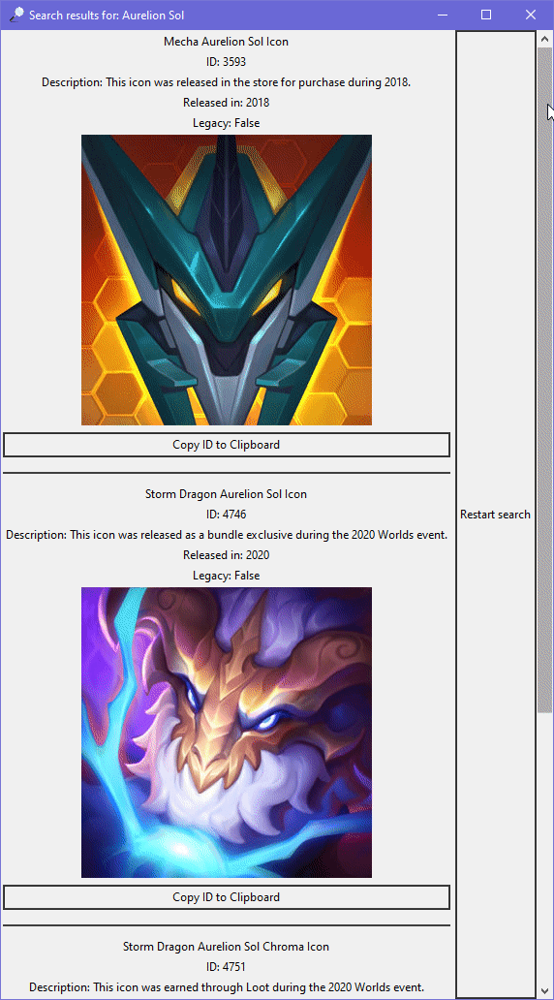

# IconIDFinder
IconIDFinder is a GUI tool to find ID of a League of Legends summoner icon by searching for a name.
# Requirements
```
Python 3.8
requests
pillow
```
# Binary version
If you don't have Python installed, I have provided binary versions [here](https://github.com/Kuuhhl/IconIDFinder/releases).
# How to use it
1. Start the program:
* Open `main.py` or `ID Finder.exe`


2. Search for your icon

* Input your query
* Press Enter / Search Button

3. Wait for the program to fetch all icons. This can take a long time, depending on your query. To minimize it, try to be as specific as possible with your search term.
4. To copy the ID, press the `Copy ID to Clipboard` button

# Issues
If you have any issues, you can report them [here](https://github.com/Kuuhhl/IconIDFinder/issues).
